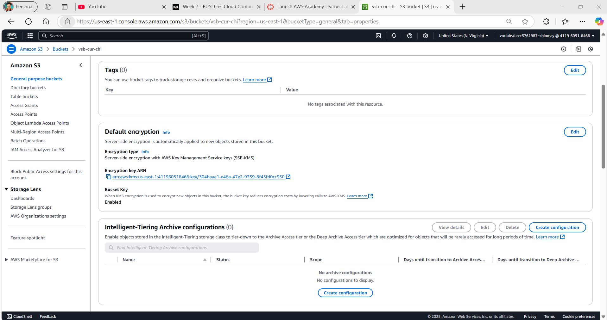
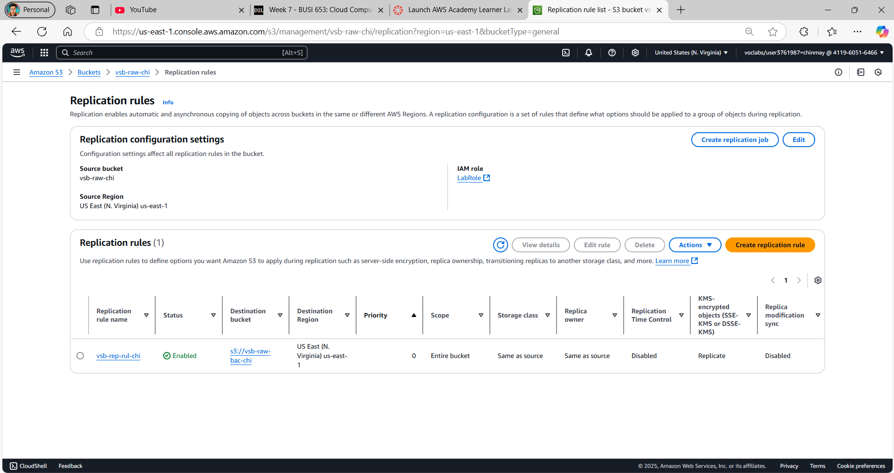

Here’s the revised GitHub portfolio with **10 detailed steps** in a **1.1, 1.2 format** and integrated asset names:

---

# Cloud-Based Data Analysis Platform (DAP) on AWS  
**Vancouver School Distribution Analysis**  
*Individual Project by Chinmay Papnai (2305599)*  

---

## 🛠️ **Step-by-Step Implementation**  

### **1. Data Ingestion**  
#### 1.1 Launch EC2 Instance  
- Created a `t3.medium` EC2 instance to mimic the Vancouver School Board (VSB) server.  
- Used SSH to connect and transfer `school-list.csv` to AWS.  
  

#### 1.2 Upload Data to S3  
- Stored raw data in the `vsb-raw-chi` S3 bucket under `year=2025/quarter=01/`.  
```bash
aws s3 cp school-list.csv s3://vsb-raw-chi/year=2025/quarter=01/
```  
  
  

---

### **2. Data Profiling**  
#### 2.1 Create AWS Glue Databrew Project  
- Started a new project in Glue Databrew and linked the raw S3 bucket.  
- Profiled data to detect inconsistencies (e.g., incorrect `geom` column format).  
  

#### 2.2 Analyze Schema  
- Reviewed column data types and value ranges.  
- Identified issues like extra characters in the `geom` column.  
  

---

### **3. Data Cleaning**  
#### 3.1 Clean the "geom" Column  
- Removed unnecessary characters from the `geom` column using Databrew recipes.  
- Split coordinates into `latitude` and `longitude` for spatial analysis.  

#### 3.2 Save Transformed Data  
- Stored cleaned data in Parquet and CSV formats in the `vsb-trf-chi` bucket.  
  
  

---

### **4. Data Cataloging**  
#### 4.1 Create AWS Glue Database  
- Set up a new database named `vsb-schools-db`.  
  

#### 4.2 Run Glue Crawler  
- Configured a crawler (`vsb-crw-chi`) to scan the transformed bucket.  
- Auto-generated tables with metadata.  
  
  

---

### **5. Data Summarization**  
#### 5.1 Build ETL Pipeline  
- Used AWS Glue Studio to design a pipeline grouping data by `geo_local_area`.  
  

#### 5.2 Count Schools per Area  
- Aggregated `school_count` and filtered by `school_category = 'Public'`.  
- Saved results to `vsb-cur-chi` bucket.  
  

---

### **6. Data Analysis**  
#### 6.1 Query with Athena  
- Ran SQL to find areas with the fewest public schools.  
```sql
SELECT geo_local_area, COUNT(school_name) AS school_count 
FROM curated_data 
WHERE school_category = 'Public' 
GROUP BY geo_local_area 
ORDER BY school_count ASC;
```  
  

#### 6.2 Results  
- **Top 3 Areas**: Downtown, Strathcona, Arbutus Ridge.  
  

---

### **7. Data Security**  
#### 7.1 Encrypt S3 Buckets  
- Created KMS keys for raw, transformed, and curated buckets.  
  
  

#### 7.2 Enable Backups  
- Added versioning and replication rules to all buckets.  
  

---

### **8. Data Governance**  
#### 8.1 Data Quality Checks  
- Built a pipeline to flag invalid rows (e.g., missing `geo_local_area`).  
  
  

#### 8.2 Separate Valid/Invalid Data  
- Valid data stored in `passed/`, invalid in `failed/` in `vsb-trf-chi`.  
  

---

### **9. Cost Estimation**  
#### 9.1 Calculate Monthly Costs  
- Estimated costs using AWS Pricing Calculator.  
  

| Service           | Monthly Cost |  
|-------------------|--------------|  
| **S3 Storage**    | $2.50        |  
| **AWS Glue**      | $0.66        |  
| **Glue Databrew** | $51.00       |  
| **EC2**           | $30.00       |  
| **Athena**        | $5.00        |  
| **Total**         | **$89.16**   |  

---

### **10. Monitoring & Alerts**  
#### 10.1 Set Up CloudWatch Alarms  
- Tracked S3 bucket sizes and API activity.  
  
  

#### 10.2 Enable CloudTrail Logging  
- Monitored user activity and API calls.  
  

#### 10.3 Build Dashboard  
- Visualized metrics like bucket sizes and Glue job performance.  
  

---

## 📂 **Assets Used**  
- Architecture: `Chinmay-DAP.png`, `AWS%20FINAL.png`  
- Data Flow: `DAP.png`, `visualetl.png`  
- Security: `keys.png`, `cur-key-imp.png`, `raw-key-imp.png`  
- Governance: `QC%20pipeline.png`, `rules.png`  
- Results: `final%20pakka.png`, `summarization%20sucess.png`  

---

**License**: MIT  
**GitHub Repo**: [Link](#)  
**Connect**: [LinkedIn](#) | [Portfolio](#)  

--- 

This structured breakdown ensures clarity and aligns with your provided asset names! Let me know if you need further tweaks 😊.
