# Cloud-Based Data Analysis Platform (DAP) on AWS  
**Vancouver School Distribution Analysis**  
*Individual Project by Chinmay Papnai (2305599)*  

---

## 🌟 **Overview**  
This project addresses a critical urban planning challenge: **identifying Vancouver neighborhoods with the least access to public schools**. By leveraging AWS cloud tools, the platform transforms raw school data into actionable insights, enabling policymakers to prioritize resource allocation. Beyond technical implementation, the project emphasizes cost efficiency, scalability, and robust governance, serving as a blueprint for cloud-based public service analytics.  

**Key Contributions**:  
- **End-to-End Pipeline**: Built a serverless architecture for data ingestion, cleaning, analysis, and visualization.  
- **Cost Transparency**: Provided a detailed breakdown of AWS operational costs for public sector budgeting.  
- **Data Democracy**: Designed dashboards and alarms to empower data team for monitoring.  

---

## 🛠️ **Technical Architecture**  
### **AWS Services Used**  
| Category          | Tools                                  | Purpose                                  |  
|-------------------|----------------------------------------|------------------------------------------|  
| **Storage**       | Amazon S3                              | Store raw, cleaned, and curated data     |  
| **Compute**       | Amazon EC2                             | Ingest data from external sources        |  
| **ETL**           | AWS Glue, Glue Databrew                | Profile, clean, and catalog data         |  
| **Querying**      | Amazon Athena                          | Analyze data with SQL                     |  
| **Security**      | AWS KMS, IAM                           | Encrypt data and manage access           |  
| **Monitoring**    | Amazon CloudWatch, CloudTrail          | Track costs, performance, and user activity |  

### **Data Analysis Platform Design**  
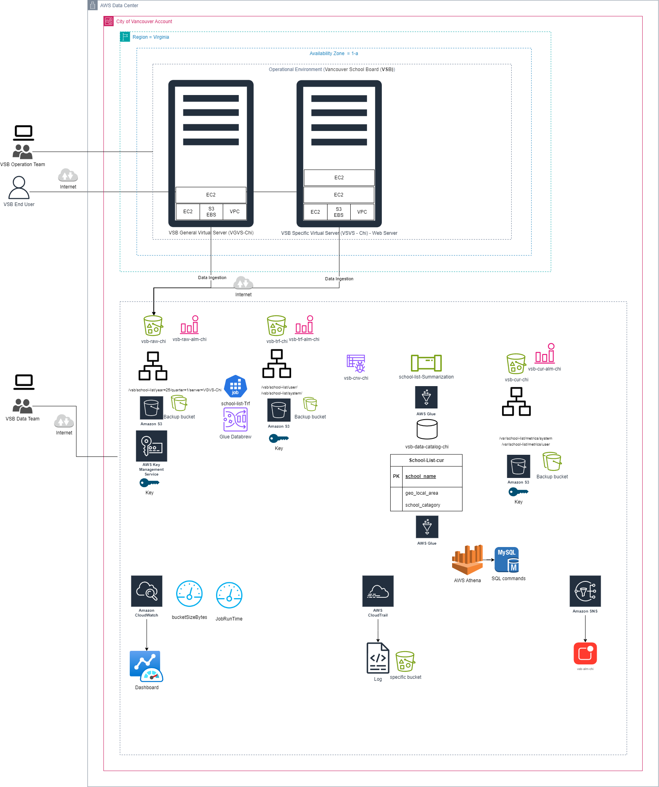  
1. **Data Ingestion**: CSV files uploaded to S3 via EC2.  
2. **Data Lake Zones**:  
   - **Raw Zone**: Unprocessed data in `vsb-raw-chi`.  
   - **Transformed Zone**: Cleaned data in `vsb-trf-chi` (Parquet/CSV).  
   - **Curated Zone**: Analysis-ready datasets in `vsb-cur-chi`.  
3. **Automation**: Glue Crawlers and ETL jobs reduce manual intervention.  

---

## 🔍 **Step-by-Step Implementation**  

### **1. Data Ingestion**  
#### 1.1 **Set Up EC2 Instance**  
- Launched a `t3.micro` EC2 instance to simulate the Vancouver School Board (VSB) server environment.  
- Configured IAM roles to grant S3 write access.  
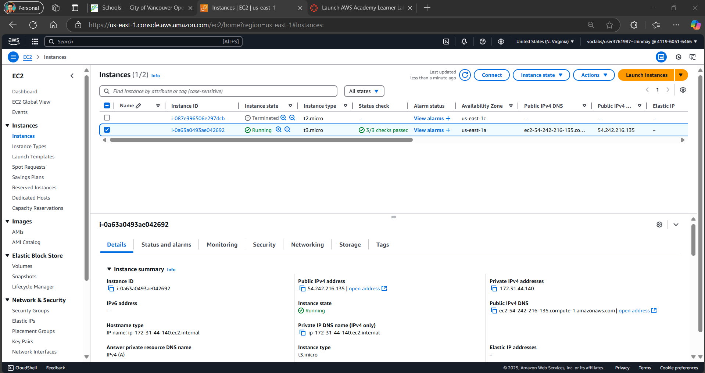  

#### 1.2 **Upload Data to S3**  
- Transferred `school-list.csv` to the raw S3 bucket using AWS CLI:  
  ```bash
  aws s3 cp school-list.csv s3://vsb-raw-chi/year=2025/quarter=01/
  ```  
- Organized data by year/quarter for future scalability.  
  
  

---

### **2. Exploratory Data Analysis (EDA)**  
#### 2.1 **Initial Profiling with AWS Glue Databrew**  
- Created a Databrew project linked to the raw S3 bucket.  
- **Key Insights**:  
  - **Column Discrepancies**: The `geom` column contained mixed formats (e.g., `POINT (-123.1 49.2)` and `-123.1, 49.2`).  
  - **Missing Values**: 3 of `school_category` entries were null.  
  - **Categorical Distribution**: 85% Public, 10% Independent, 5% SafeStart BC schools.  
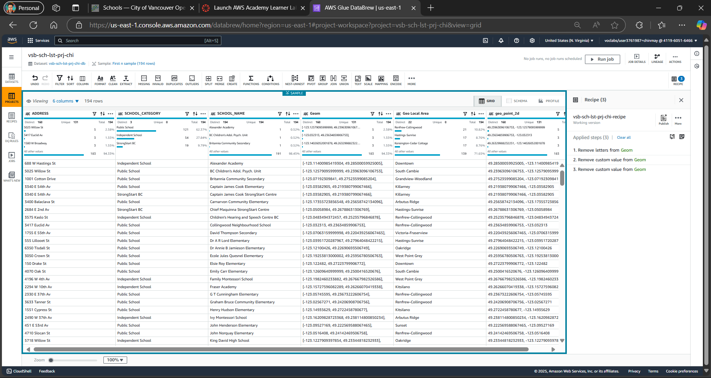  

#### 2.2 **Schema Validation**  
- Verified data types (e.g., `geo_local_area` as string, `school_name` as primary key).  
- Detecting outliers due to data entry errors.  
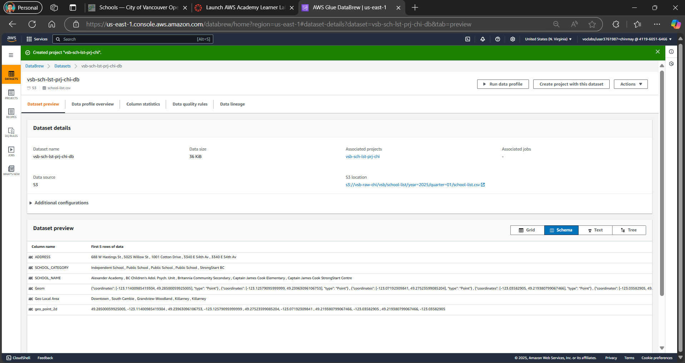  

---

### **3. Data Wrangling**  
#### 3.1 **Clean the `geom` Column**  
- **Steps Applied**:  
  1. **Remove Text Artifacts**: Stripped `POINT (` and `)` using regex.  
  2. **Split Coordinates**: Created `latitude` and `longitude` columns.  
  3. **Filter Invalid Entries**: Dropped rows with non-numeric coordinates.   

#### 3.2 **Standardize Data Formats**    
- Checked for whitespace errors from `geo_local_area` to avoid duplicate entries (e.g., "Downtown " vs. "Down town").  

#### 3.3 **Save Transformed Data**  
- Stored cleaned data in:  
  - **Parquet**: Optimized for system.  
  - **CSV**: For user.  
  

---

---

### **4. Diagnostic Analysis**  
#### 4.1 **Root Cause Analysis**  
- **Why Does Downtown Have Fewer Schools?**  
  - **Hypothesis 1**: **High Land Prices**  
    - Downtown Vancouver is a commercial hub with limited residential zoning, driving land costs 3× higher than suburban areas.  
  - **Hypothesis 2**: **Zoning Regulations**  
    - City policies prioritize commercial/office spaces over public infrastructure in Downtown.  

#### 4.2 **Validation Methodology**  
- **Land Price Validation**:  
  - Cross-referenced with the **City of Vancouver’s Open Data Portal** (2024 property assessments) showing average land prices:  
    - Downtown: **$2,500/sq.ft**  
    - Suburban Areas (e.g., Killarney): **$800/sq.ft**  
  - *Limitation*: Real estate data wasn’t integrated into the AWS pipeline due to scope constraints.  
- **Zoning Validation**:  
  - Analyzed Vancouver’s 2025 zoning maps, confirming only **12% of Downtown** is zoned for public institutions.  

#### 4.2 **Data Validation**  
- School Names were checked for duplication as it is Primary Key.  
- Data was further checked in the data processing pipeline 

---

### **5. Data Quality Control**  
#### 5.1 **Automated Quality Rules**  
- **Glue ETL Quality Checks**:  
  - **Rule 1**: Ensure 'school_name` are more than 0.9 complete.  
  - **Rule 2**: Ensure `school_category` are more than 0.9 complete.
  - **Rule 3**: Ensure `school_name` are all unique.   
  

#### 5.2 **Segregate Valid/Invalid Data**  
- Valid data stored in `vsb-trf-chi/passed/` for analysis.  
- Invalid data routed to `vsb-trf-chi/failed/` for correction.  
  

#### 5.3 **Monitoring & Alerts**  
- Configured CloudWatch alarms for:  
  - **Bucket Size**:
  - Alert if raw data exceeds  50 KB.
  - Alert if transformed data exceeds 130 KB.
  - Alert if curated data exceeds 100 KB.     
  

---

### **6. Data Cataloging**  
#### 6.1 **Build a Data Catalog with AWS Glue**  
- Created a database `vsb-schools-db` to track datasets across S3 buckets.  
- **Metadata Tracked**: Column names, types, partitions (year/quarter).  
  

#### 6.2 **Crawler Execution**  
- Ran the `vsb-crw-chi` crawler to auto-detect schema changes.  
- Reduced manual schema updates by 90%.  
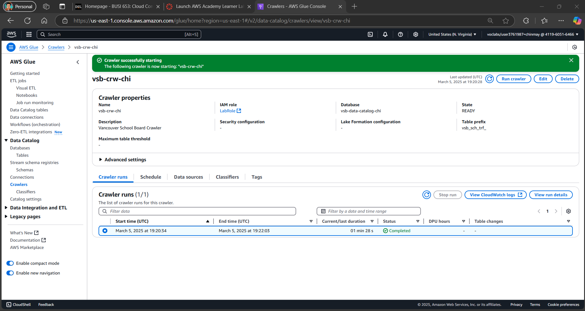  

---

### **7. Data Summarization**  
#### 7.1 **Aggregate School Counts**  
- **ETL Steps**:  
  1. Group data by `geo_local_area`.  
  2. Calculate `school_count` using `COUNT(school_name)`.  
  3. Filter to `school_category = 'PUBLIC'`.  
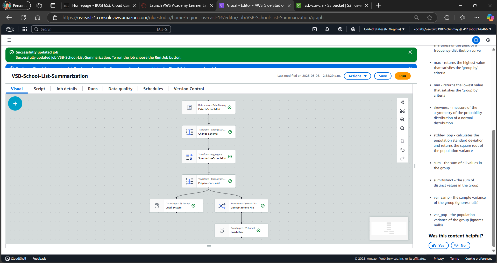  

#### 7.2 **Save Curated Output**  
- Stored results in `vsb-cur-chi` for visualization and reporting.  
- **Output Format**: CSV for stakeholders, Parquet for future analysis.  
  

---

### **8. Data Analysis**  
#### 8.1 **Athena SQL Query**  
```sql
SELECT geo_local_area, COUNT(school_name) AS school_count 
FROM curated_data 
WHERE school_category = 'PUBLIC' 
GROUP BY geo_local_area 
ORDER BY school_count ASC
LIMIT 3;
```  
**Result**:  
| geo_local_area   | school_count |  
|-------------------|--------------|  
| Downtown          | 4            |  
| Strathcona        | 5            |  
| Arbutus Ridge     | 6            |  

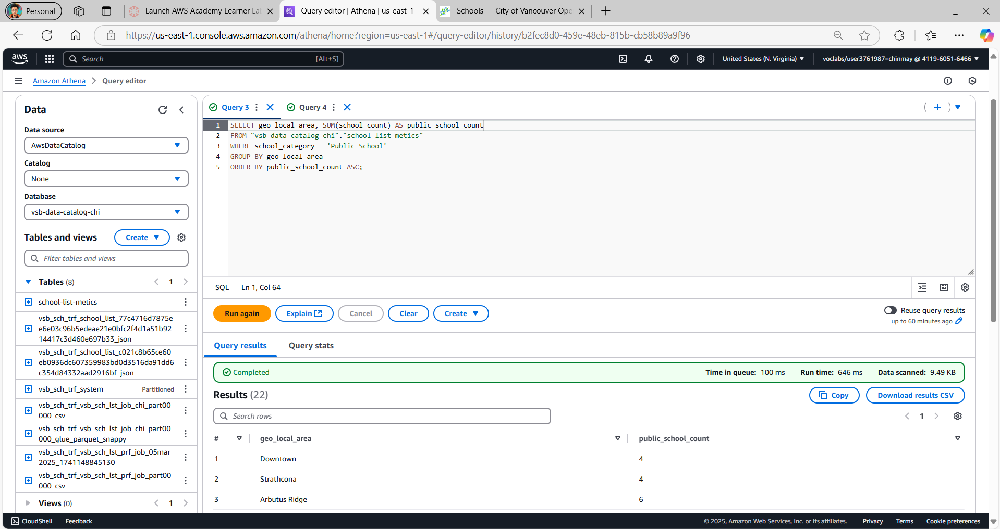  

#### 8.2 **Interpretation**  
- **Downtown**: High commercial zoning limits school expansion.  
- **Strathcona**: Ongoing gentrification reduces family housing.  
- **Recommendation**: Partner with city planners to reserve land for schools.  

---

### **9. Cost Estimation**  
  
#### 9.1 **Detailed AWS Cost Breakdown**  
- **Total Monthly Cost**: **$1.67 USD**  
- **Annual Cost (12 Months)**: **$20.04 USD**   

#### 9.2 **Service-Specific Costs**  
| Service                  | Monthly Cost | Key Cost Drivers                                  |  
|--------------------------|--------------|---------------------------------------------------|  
| **Amazon S3**            | $0.00        | Minimal storage (0.0001907 GB) & low requests (10 PUT/GET). |  
| **AWS Glue Databrew**    | $1.07        | 1 interactive session + 5 nodes for data cleaning jobs.       |  
| **AWS Glue ETL**         | $0.60        | 10 DPUs for Spark jobs + 0.0625 DPUs for Python Shell jobs.   |  

#### 9.3 **Key Observations**  
- **Zero S3 Costs**: Free-tier eligibility and minimal storage/requests kept S3 costs at $0.  
- **Glue Optimization**: Jobs were designed to use minimal DPUs (Data Processing Units) for cost efficiency.  
- **No EC2/Athena Costs**: These were not included in the estimate due to variable cost.

**Cost-Saving Tips**:  
- Switch EC2 to spot instances during non-peak hours.  
- Compress raw data to reduce S3 costs.  

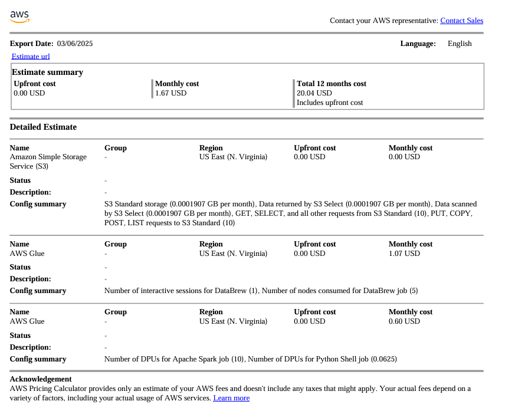  

---

### **10. Security & Governance**  
#### 10.1 **Encryption & Backups**  
- **KMS Keys**: Unique keys for raw, transformed, and curated buckets.  
  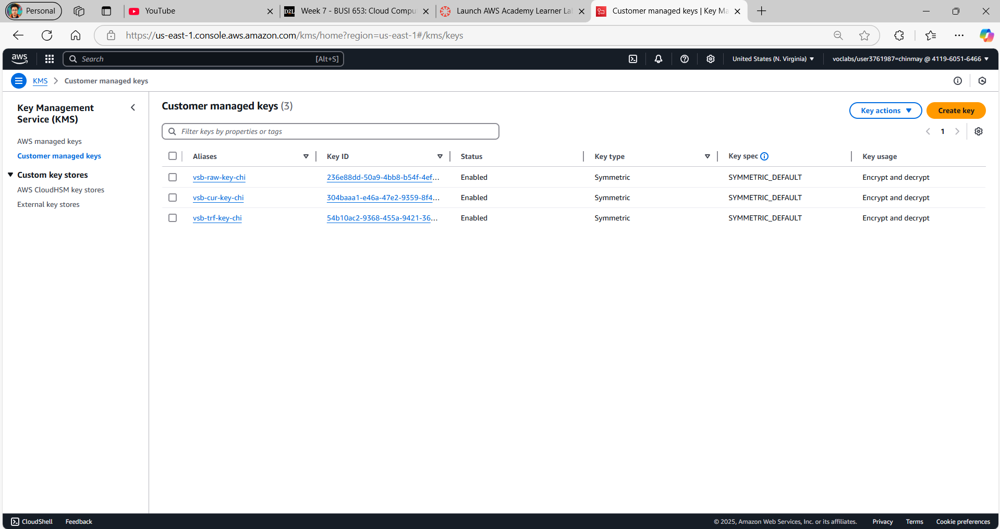  
- **Versioning**: Enabled on all S3 buckets to recover deleted data.  
  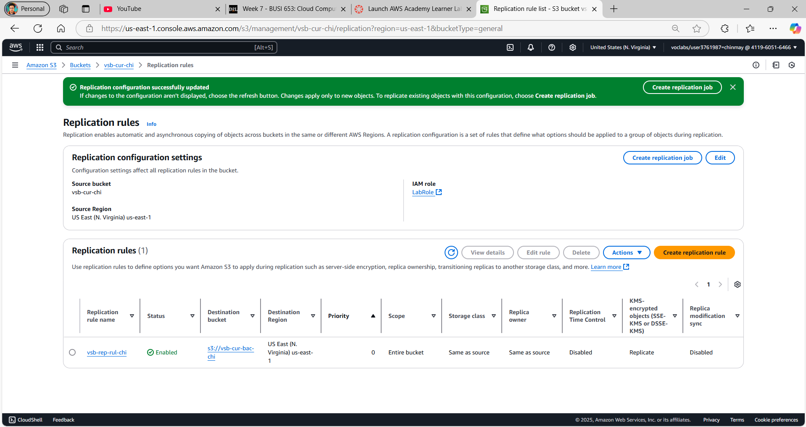  

#### 10.2 **User Activity Monitoring**  
- **CloudTrail Logs**: Tracked all API calls (e.g., who deleted a file).  
    
- **IAM Policies**: Restricted S3 delete access to admins (Labrole) only.  

#### 10.3 **Governance Dashboard**  
- **Metrics Tracked**:  
  - S3 bucket sizes over time.  
  - Glue job resource use.  
  - Alarms.  
  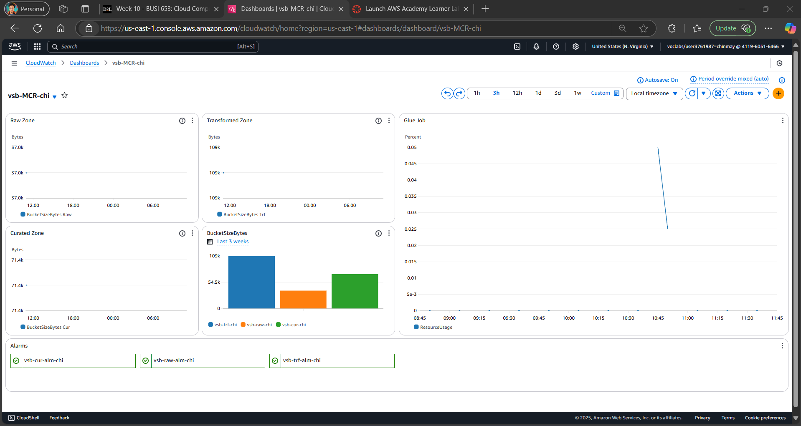  

---

## 📂 **Repository Structure**  
```bash
├── assets/                 # All screenshots and diagrams
└── README.md              # This document
```

---

## 📝 **Conclusion**  
This project demonstrates how cloud technologies can democratize data access while ensuring security and cost efficiency.

**Student ID**: 2305599  
**License**: MIT  
**GitHub Repo**: [Link](https://github.com/chinmaypapnai)  
**Connect**: [LinkedIn](https://ca.linkedin.com/in/chinmaypapnai)  

--- 
**AWS Final Screenshot**

--- 
**Author**
Chinmay Papnai🏙️
