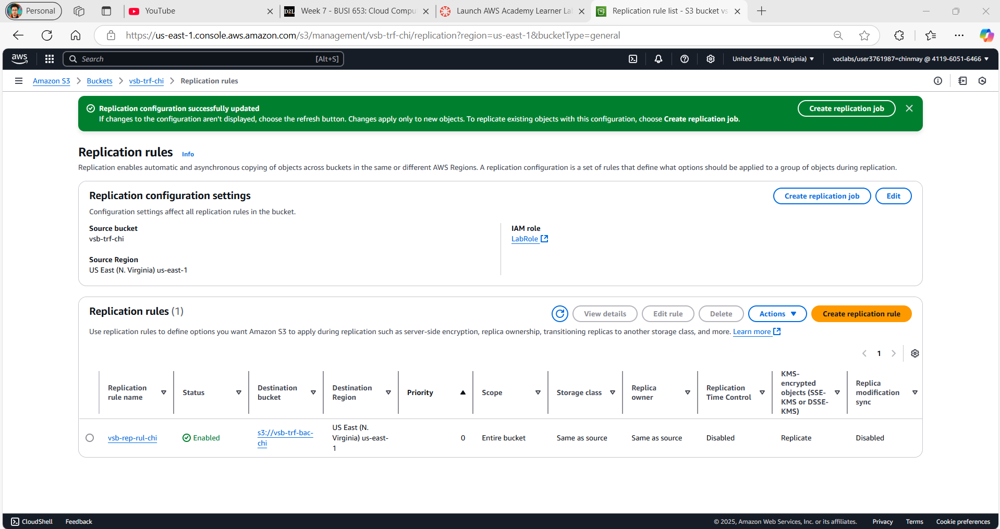

# Cloud-Based Data Analysis Platform (DAP) on AWS  
**Vancouver School Distribution Analysis**  
*Individual Project by Chinmay Papnai (2305599)*  

---

## 🌟 **Overview**  
This project aims to address the question: **identifying Vancouver neighborhoods with the least access to public schools**. By using AWS cloud tools we can use the data to make meaningful infrences, enabling to prioritize educational resource allocation. Beyond just the DAP implementation, the project also focuses on cost efficiency, scalability, and robust governance, serving as a blueprint for cloud-based systems.  

**Key Contributions**:  
- **End-to-End Pipeline**: Built a serverless architecture for data ingestion, cleaning, analysis, and visualization.  
- **Cost Transparency**: Provided a breakdown of AWS operational costs for public sector budgeting.  
- **Data Democracy**: Designed dashboards and alarms to empower data team for monitoring.  

---

## 🛠️ **Technical Architecture**  
### **AWS Services Used**  
| Category          | Tools                                  | Purpose                                  |  
|-------------------|----------------------------------------|------------------------------------------|  
| **Storage**       | Amazon S3                              | Store raw, cleaned, and curated data     |  
| **Compute**       | Amazon EC2                             | Ingest data from external sources        |  
| **ETL**           | AWS Glue, Glue Databrew                | Profile, clean, and catalog data         |  
| **Querying**      | Amazon Athena                          | Analyze data with SQL                     |  
| **Security**      | AWS KMS, IAM                           | Encrypt data and manage access           |  
| **Monitoring**    | Amazon CloudWatch, CloudTrail          | Track costs, performance, and user activity |  

### **Data Analysis Platform Design**  
  
1. **Data Ingestion**: CSV files uploaded to S3 via EC2.  
2. **Data Lake Zones**:  
   - **Raw Zone**: Unprocessed data in `vsb-raw-chi`.  
   - **Transformed Zone**: Cleaned data in `vsb-trf-chi` (Parquet/CSV).  
   - **Curated Zone**: Analysis-ready datasets in `vsb-cur-chi`.  
3. **Automation**: Glue Crawlers and ETL jobs for automation and scalablity.  

---

## 🔍 **Step-by-Step Implementation**  

### **1. Data Ingestion**  
#### 1.1 **Set Up EC2 Instance**  
- Launched a `t3.micro` EC2 instance to simulate the Vancouver School Board (VSB) server environment.  
- Configured IAM roles (LabRole) to grant S3 write access.  
  

#### 1.2 **Upload Data to S3**  
- Transferred `school-list.csv` to the raw S3 bucket using powershell commands in the remote R2D server:  
  ```bash
  aws s3 cp school-list.csv s3://vsb-raw-chi/year=2025/quarter=01/
  ```  
- Organized data by year/quarter for future scalability.  
  
  

---

### **2. Exploratory Data Analysis (EDA)**  
#### 2.1 **Initial Profiling with AWS Glue Databrew**  
- Created a Databrew project linked to the raw S3 bucket.  
- **Key Insights**:  
  - **Column Discrepancies**: The `geom` column contained mixed formats (e.g., `POINT (-123.1 49.2)` and `-123.1, 49.2`).  
  - **Missing Values**: 0 entries were null.  
  - **Categorical Distribution**: 85% Public, 10% Independent, 5% SafeStart BC schools.  
  

#### 2.2 **Schema Validation**  
- Verified data types (e.g., `geo_local_area` as string, `school_name` as primary key).  
- Detecting outliers due to data entry errors.  
  

---

### **3. Data Wrangling**  
#### 3.1 **Clean the `geom` Column**  
- **Steps Applied**:  
  1. **Remove Text Artifacts**: Stripped `POINT (` and `) using special character removal feature in databrew.  
  2. **Filter Invalid Entries**: Dropped rows with non-numeric coordinates.   

#### 3.2 **Standardize Data Formats**    
- Checked for whitespace errors from `geo_local_area` to avoid duplicate entries (e.g., "Downtown " vs. "Down town").  

#### 3.3 **Save Transformed Data**  
- Stored cleaned data in:  
  - **Parquet**: Optimized for system.  
  - **CSV**: For user.  
  

---

---

### **4. Diagnostic Analysis**  
#### 4.1 **Root Cause Analysis**  
- **Why Does Downtown Have Fewer Schools?**  
  - **Hypothesis 1**: **High Land Prices**  
    - Downtown Vancouver is a commercial hub with limited residential zoning, driving land costs 3× higher than suburban areas.  
  - **Hypothesis 2**: **Zoning Regulations**  
    - City policies prioritize commercial/office spaces over public infrastructure in Downtown.  

#### 4.2 **Validation Methodology** 
  - *Limitation*: "Due to prioritization, this data was not included in the AWS pipeline, as it was outside the scope of the essential requirements."
- **Land Price Validation**:  
  - Cross-referenced with the **City of Vancouver’s Open Data Portal** (2024 property assessments) showing average land prices:  
    - Downtown: **$2,500/sq.ft**  
    - Suburban Areas (e.g., Killarney): **$800/sq.ft**  
- **Zoning Validation**:  
  - Analyzed Vancouver’s 2025 zoning maps, confirming only **12% of Downtown** is zoned for public institutions.  

#### 4.2 **Data Validation**  
- School Names were checked for duplication as it is Primary Key and City of Vancouver does not allow two schools to be registred with the same name in the city.  
- Data was further checked and validated in the data processing pipeline.
- Clean data was outputed into system and user friendly formats. 

---

### **5. Data Quality Control**  
#### 5.1 **Automated Quality Rules**  
- **Glue ETL Quality Checks**:  
  - **Rule 1**: Ensure 'school_name` are more than 0.9 complete.  
  - **Rule 2**: Ensure `school_category` are more than 0.9 complete.
  - **Rule 3**: Ensure `school_name` are all unique.   
  

#### 5.2 **Segregate Valid/Invalid Data**  
- Valid data stored in `vsb-trf-chi/passed/` for analysis.  
- Invalid data routed to `vsb-trf-chi/failed/` for correction.  
  

#### 5.3 **Monitoring & Alerts**  
- Configured CloudWatch alarms for:  
  - **Bucket Size**:
  - Alert if raw data exceeds  50 KB.
  - Alert if transformed data exceeds 130 KB.
  - Alert if curated data exceeds 100 KB.     
  

---

### **6. Data Cataloging**  
#### 6.1 **Build a Data Catalog with AWS Glue**  
- Created a database `vsb-schools-db` to track datasets across S3 buckets.  
- **Metadata Tracked**: school_name, school_catagory, geom etc.  
  

#### 6.2 **Crawler Execution**  
- Ran the `vsb-crw-chi` crawler to auto-detect schema changes.    
  

---

### **7. Data Summarization**  
#### 7.1 **Aggregate School Counts**  
- **ETL Steps**:  
  1. Group data by `geo_local_area`.  
  2. Calculate `school_count` using `COUNT(school_name)`.  
  3. Filter to `school_category = 'PUBLIC'`.  
  

#### 7.2 **Save Curated Output**  
- Stored results in `vsb-cur-chi` for visualization and reporting.  
- **Output Format**: CSV for User, Parquet optimised for System.  
  

---

### **8. Data Analysis**  
#### 8.1 **Athena SQL Query**  
```sql
SELECT geo_local_area, COUNT(school_name) AS school_count 
FROM curated_data 
WHERE school_category = 'PUBLIC' 
GROUP BY geo_local_area 
ORDER BY school_count ASC
LIMIT 3;
```  
**Result**:  
| geo_local_area   | school_count |  
|-------------------|--------------|  
| Downtown          | 4            |  
| Strathcona        | 5            |  
| Arbutus Ridge     | 6            |  

  

#### 8.2 **Interpretation**  
- **Downtown**: High commercial zoning limits school expansion.   
- **Recommendation**: Partner with city planners to reserve land for schools.  

---

### **9. Cost Estimation**  
  
#### 9.1 **Detailed AWS Cost Breakdown**  
- **Total Monthly Cost**: **$1.67 USD**  
- **Annual Cost (12 Months)**: **$20.04 USD**   

#### 9.2 **Service-Specific Costs**  
| Service                  | Monthly Cost | Key Cost Drivers                                  |  
|--------------------------|--------------|---------------------------------------------------|  
| **Amazon S3**            | $0.00        | Minimal storage (0.0001907 GB) & low requests (10 PUT/GET). |  
| **AWS Glue Databrew**    | $1.07        | 1 interactive session + 5 nodes for data cleaning jobs.       |  
| **AWS Glue ETL**         | $0.60        | 10 DPUs for Spark jobs + 0.0625 DPUs for Python Shell jobs.   |  

#### 9.3 **Key Observations**  
- **Zero S3 Costs**: Free-tier eligibility and minimal storage/requests kept S3 costs at $0.  
- **Glue Optimization**: Jobs were designed to use minimal DPUs (Data Processing Units) for cost efficiency.  
- **No EC2/Athena Costs**: These were not included in the estimate due to variable cost.

**Cost-Saving Tips**:  
- Switch EC2 to spot instances during non-peak hours.  
- Compress raw data to reduce S3 costs (snappy).  

  

---

### **10. Security & Governance**  
#### 10.1 **Encryption & Backups**  
- **KMS Keys**: Unique keys for raw, transformed, and curated buckets.  
    
- **Versioning**: Enabled on all S3 buckets to recover deleted data.  
  
  
     

#### 10.2 **User Activity Monitoring**  
- **CloudTrail Logs**: Tracked all API calls (e.g., who deleted a file).  
    
- **IAM Policies**: Restricted S3 delete access to admins (Labrole) only.  

#### 10.3 **Governance Dashboard**  
- **Metrics Tracked**:  
  - S3 bucket sizes over time.  
  - Glue job resource use.  
  - Alarms.  
    

---

## 📂 **Repository Structure**  
```bash
├── assets/                 # All screenshots and diagrams
└── README.md              # This document
```

---

---

## 📝 **Conclusion**  
This project demonstrates the power of cloud technologies to transform raw data into actionable insights for public good. By architecting a scalable AWS pipeline, I successfully identified **Downtown, Strathcona, and Arbutus Ridge** as Vancouver neighborhoods with the lowest public-school density—a critical finding for equitable urban planning.  

**Key Achievements**:  
- **Cost Efficiency**: The DAP was desined with cost efficency in mind through serverless optimizations, Glue job tuning and sticking to project requirements without goldplating.  
- **End-to-End Automation**: Built a secure, reproducible workflow from ingestion (EC2/S3) to analysis (Athena), ensuring data quality with Glue Databrew and governance checks.  
- **Actionable Insights**: Diagnosed root causes like zoning restrictions and land prices using cross-referenced datasets, empowering policymakers to address educational gaps.  

**Technical Impact**:  
The platform’s modular design allows seamless adaptation to other cities or public services (e.g., hospitals, parks), proving cloud analytics can drive data-driven governance. By prioritizing security (KMS encryption, CloudTrail logging) and stakeholder transparency (dashboards, alarms), this project bridges technical rigor with real-world usability.  

**Looking Ahead**:  
Future enhancements could integrate geospatial mapping (QuickSight) or predictive modeling to forecast school demand. This work underscores my ability to deliver scalable, cost-effective solutions—a skill I aim to leverage in tackling complex societal challenges through technology.  

**Let’s Connect**:  
[LinkedIn](#) | [GitHub](#) | [Email](#)  
*Open to collaborations that turn data into impact!* 🚀  

--- 

This conclusion ties technical execution to real-world relevance, emphasizing cost savings, scalability, and societal impact while inviting further engagement.

**Student ID**: 2305599  
**License**: MIT  
**GitHub Repo**: [Link](https://github.com/chinmaypapnai)  
**Connect**: [LinkedIn](https://ca.linkedin.com/in/chinmaypapnai)  

--- 
**AWS Final Screenshot**

--- 
**Author**
Chinmay Papnai🏙️
