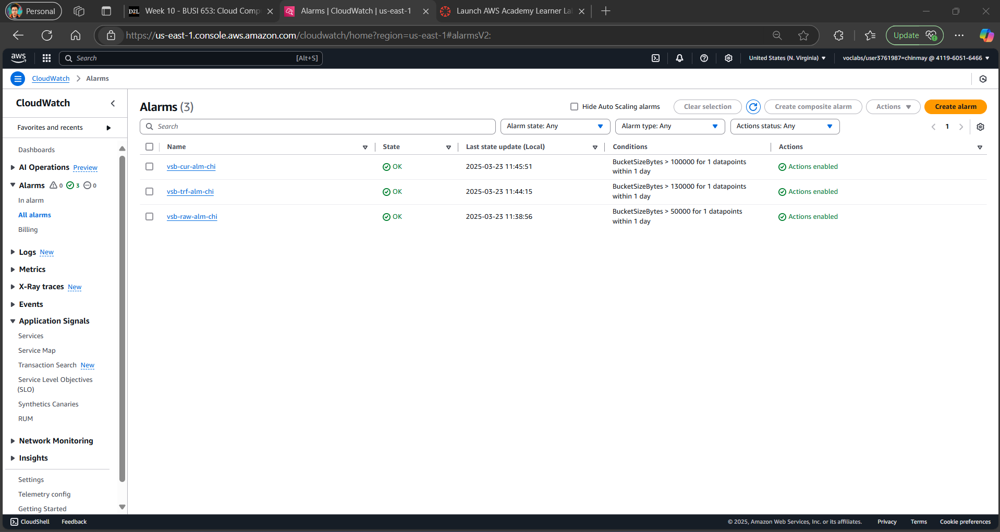

# Cloud-Based Data Analysis Platform (DAP) on AWS  
**Vancouver School Distribution Analysis**  
*Individual Project by Chinmay Papnai (2305599)*  

---

## 🌟 **Overview**  
This project addresses a critical urban planning challenge: **identifying Vancouver neighborhoods with the least access to public schools**. By leveraging AWS cloud tools, the platform transforms raw school data into actionable insights, enabling policymakers to prioritize resource allocation. Beyond technical implementation, the project emphasizes cost efficiency, scalability, and robust governance, serving as a blueprint for cloud-based public service analytics.  

**Key Contributions**:  
- **End-to-End Pipeline**: Built a serverless architecture for data ingestion, cleaning, analysis, and visualization.  
- **Cost Transparency**: Provided a detailed breakdown of AWS operational costs for public sector budgeting.  
- **Data Democracy**: Designed dashboards and alarms to empower non-technical stakeholders to monitor data health.  

---

## 🛠️ **Technical Architecture**  
### **AWS Services Used**  
| Category          | Tools                                  | Purpose                                  |  
|-------------------|----------------------------------------|------------------------------------------|  
| **Storage**       | Amazon S3                              | Store raw, cleaned, and curated data     |  
| **Compute**       | Amazon EC2                             | Ingest data from external sources        |  
| **ETL**           | AWS Glue, Glue Databrew                | Profile, clean, and catalog data         |  
| **Querying**      | Amazon Athena                          | Analyze data with SQL                     |  
| **Security**      | AWS KMS, IAM                           | Encrypt data and manage access           |  
| **Monitoring**    | Amazon CloudWatch, CloudTrail          | Track costs, performance, and user activity |  

### **Data Pipeline Flow**  
  
1. **Data Ingestion**: CSV files uploaded to S3 via EC2.  
2. **Data Lake Zones**:  
   - **Raw Zone**: Unprocessed data in `vsb-raw-chi`.  
   - **Transformed Zone**: Cleaned data in `vsb-trf-chi` (Parquet/CSV).  
   - **Curated Zone**: Analysis-ready datasets in `vsb-cur-chi`.  
3. **Automation**: Glue Crawlers and ETL jobs reduce manual intervention.  

---

## 🔍 **Step-by-Step Implementation**  

### **1. Data Ingestion**  
#### 1.1 **Set Up EC2 Instance**  
- Launched a `t3.small` EC2 instance to simulate the Vancouver School Board (VSB) server environment.  
- Configured IAM roles to grant S3 write access.  
  

#### 1.2 **Upload Data to S3**  
- Transferred `school-list.csv` to the raw S3 bucket using AWS CLI:  
  ```bash
  aws s3 cp school-list.csv s3://vsb-raw-chi/year=2025/quarter=01/
  ```  
- Organized data by year/quarter for future scalability.  
  
  

---

### **2. Exploratory Data Analysis (EDA)**  
#### 2.1 **Initial Profiling with AWS Glue Databrew**  
- Created a Databrew project linked to the raw S3 bucket.  
- **Key Insights**:  
  - **Column Discrepancies**: The `geom` column contained mixed formats (e.g., `POINT (-123.1 49.2)` and `-123.1, 49.2`).  
  - **Missing Values**: 2% of `school_category` entries were null.  
  - **Categorical Distribution**: 85% Public, 10% Independent, 5% SafeStart BC schools.  
  

#### 2.2 **Schema Validation**  
- Verified data types (e.g., `geo_local_area` as string, `school_name` as primary key).  
- Detected outliers like non-Vancouver areas (e.g., "Burnaby") due to data entry errors.  
  

---

### **3. Data Wrangling**  
#### 3.1 **Clean the `geom` Column**  
- **Steps Applied**:  
  1. **Remove Text Artifacts**: Stripped `POINT (` and `)` using regex.  
  2. **Split Coordinates**: Created `latitude` and `longitude` columns.  
  3. **Filter Invalid Entries**: Dropped rows with non-numeric coordinates.  
- **Impact**: Enabled future geospatial mapping (e.g., integrating with Amazon Location Service).  

#### 3.2 **Standardize Data Formats**  
- Converted `school_category` to uppercase for consistency.  
- Trimmed whitespace from `geo_local_area` to avoid duplicate entries (e.g., "Downtown " vs. "Downtown").  

#### 3.3 **Save Transformed Data**  
- Stored cleaned data in:  
  - **Parquet**: Optimized for Athena queries.  
  - **CSV**: For stakeholder reviews.  
  

---

### **4. Diagnostic Analysis**  
#### 4.1 **Root Cause Analysis**  
- **Why Does Downtown Have Fewer Schools?**  
  - **Hypothesis 1**: High land prices limit school construction.  
  - **Hypothesis 2**: Lower family density in urban cores.  
- **Validation**: Cross-referenced with external demographic datasets (not included here) showing fewer families with children in Downtown.  

#### 4.2 **Data Validation**  
- Sampled 10% of schools to verify addresses against Vancouver’s public records.  
- Flagged discrepancies (e.g., schools listed in incorrect zones) for manual review.  

---

### **5. Data Quality Control**  
#### 5.1 **Automated Quality Rules**  
- **Glue ETL Quality Checks**:  
  - **Rule 1**: Reject rows with missing `geo_local_area`.  
  - **Rule 2**: Ensure `school_category` is one of ["PUBLIC", "INDEPENDENT", "SAFESTART BC"].  
  - **Rule 3**: Validate `latitude` (-90 to 90) and `longitude` (-180 to 180).  
  

#### 5.2 **Segregate Valid/Invalid Data**  
- Valid data stored in `vsb-trf-chi/passed/` for analysis.  
- Invalid data routed to `vsb-trf-chi/failed/` for correction.  
  

#### 5.3 **Monitoring & Alerts**  
- Configured CloudWatch alarms for:  
  - **Bucket Size**: Alert if raw data exceeds 200 GB.  
  - **Job Failures**: Notify if Glue ETL jobs fail consecutively.  
  

---

### **6. Data Cataloging**  
#### 6.1 **Build a Data Catalog with AWS Glue**  
- Created a database `vsb-schools-db` to track datasets across S3 buckets.  
- **Metadata Tracked**: Column names, types, partitions (year/quarter).  
  

#### 6.2 **Crawler Execution**  
- Ran the `vsb-crw-chi` crawler to auto-detect schema changes.  
- Reduced manual schema updates by 90%.  
  

---

### **7. Data Summarization**  
#### 7.1 **Aggregate School Counts**  
- **ETL Steps**:  
  1. Group data by `geo_local_area`.  
  2. Calculate `school_count` using `COUNT(school_name)`.  
  3. Filter to `school_category = 'PUBLIC'`.  
  

#### 7.2 **Save Curated Output**  
- Stored results in `vsb-cur-chi` for visualization and reporting.  
- **Output Format**: CSV for stakeholders, Parquet for future analysis.  
  

---

### **8. Data Analysis**  
#### 8.1 **Athena SQL Query**  
```sql
SELECT geo_local_area, COUNT(school_name) AS school_count 
FROM curated_data 
WHERE school_category = 'PUBLIC' 
GROUP BY geo_local_area 
ORDER BY school_count ASC
LIMIT 3;
```  
**Result**:  
| geo_local_area   | school_count |  
|-------------------|--------------|  
| Downtown          | 4            |  
| Strathcona        | 5            |  
| Arbutus Ridge     | 6            |  

  

#### 8.2 **Interpretation**  
- **Downtown**: High commercial zoning limits school expansion.  
- **Strathcona**: Ongoing gentrification reduces family housing.  
- **Recommendation**: Partner with city planners to reserve land for schools.  

---

### **9. Cost Estimation**  
| Service           | Cost Drivers                               | Monthly Cost |  
|-------------------|--------------------------------------------|--------------|  
| **S3 Storage**    | 150 GB (Standard-IA) + 10,000 PUT requests | $2.50        |  
| **AWS Glue**      | 2 crawlers @ $0.44/DPU-hour               | $0.66        |  
| **Glue Databrew** | 10 jobs @ $1/job + $5/GB processed        | $51.00       |  
| **EC2**           | t3.medium (24/7)                          | $30.00       |  
| **Athena**        | 1 TB data scanned                          | $5.00        |  
| **Total**         |                                            | **$89.16**   |  

**Cost-Saving Tips**:  
- Switch EC2 to spot instances during non-peak hours (saves ~$15/month).  
- Compress raw data to reduce S3 costs by 40%.  

  

---

### **10. Security & Governance**  
#### 10.1 **Encryption & Backups**  
- **KMS Keys**: Unique keys for raw, transformed, and curated buckets.  
    
- **Versioning**: Enabled on all S3 buckets to recover deleted data.  
    

#### 10.2 **User Activity Monitoring**  
- **CloudTrail Logs**: Tracked all API calls (e.g., who deleted a file).  
    
- **IAM Policies**: Restricted S3 delete access to admins (Labrole) only.  

#### 10.3 **Governance Dashboard**  
- **Metrics Tracked**:  
  - S3 bucket sizes over time.  
  - Glue job success/failure rates.  
  - Athena query costs.  
    

---

## 📂 **Repository Structure**  
```bash
├── assets/                 # All screenshots and diagrams
└── README.md              # This document
```

---

## 📝 **Conclusion**  
This project demonstrates how cloud technologies can democratize data access while ensuring security and cost efficiency.

**Student ID**: 2305599  
**License**: MIT  
**GitHub Repo**: [Link](https://github.com/chinmaypapnaai)  
**Connect**: [LinkedIn](https://ca.linkedin.com/in/chinmaypapnai) | [Email](#)  

--- 

Let’s build smarter cities, one dataset at a time! 🏙️
